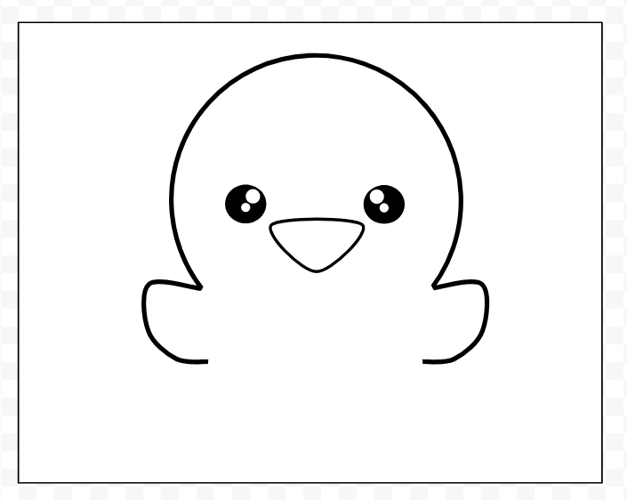

All done on 07/25/2025
Total time: 5 hrs

## Schematic (1 hr)
I used EasyEDA to design the schematic. It includes an NFC chip, an LED, a capacitor, and a resistor. The NFC chip is the main component that allows for wireless data transmission.

## Collecting Art + Plan Layout (1.5 hr)
I collected the different elements I wanted to include on the card and planned the layout on a Canva whiteboard. 

## PCB Design (1.5 hrs)
I used EasyEDA to design the PCB layout. The design includes the NFC chip, LED, capacitor, and resistor. I made sure to follow the schematic and ensure that all components were correctly placed, but struggled with connecting the wire to the NFC chip. Got it to work in the end :)

## Art (1 hr)
When looking through the Slack for how to submit, I found a thread saying we needed custom art on our HackerCard. So, I used Google Drawings to create a cute little duck doodle ( not an artist, especially not digital, but tried my best :D ):

Then I went to add this to my pcb :)!
[duckie on pcb](images/hello-duck.png.png)

## Final Look 👀

